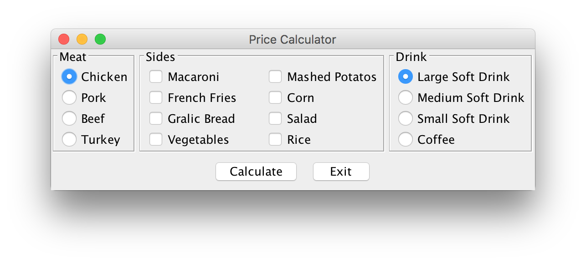

# PriceCalculatorGUI
*This is my first small project using GUI*

## Description
In this project I used knowledge that I learned from my first academic year and as well knowledge that I studied by myself. For making this project I used Eclipse enviroment. This simple application lets user select an item that he/she wants to order and then it calculates the price in another windows

## Screenshots

